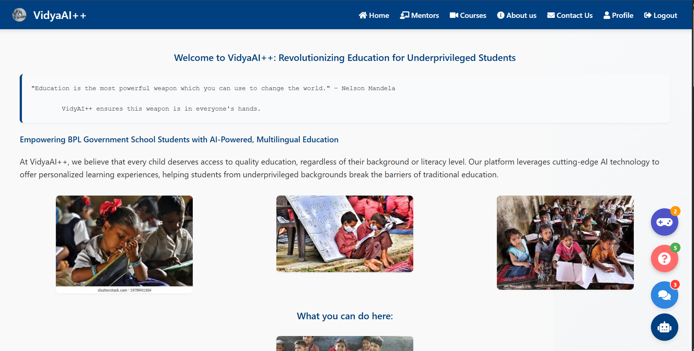

# VidyaAI++  : 🎓 AI-Powered Student Learning Assistant    

## 🚀 Deployment

Check out the live application here:  
👉 [Live Site](https://vidya-ai-project.onrender.com)

## Selected Domain : AI&ML

## Problem Statement / Use Case
Design and develop an AI-powered, multilingual, and inclusive web platform to provide personalized education, mentorship, and learning support to underprivileged (BPL) students enrolled in government schools across India. The system should align with the National Education Policy (NEP) and offer dynamic, interactive, and accessible learning experiences using cutting-edge AI technologies. 

## 📘Description
This project is an intelligent educational web platform designed to revolutionize how students learn and practice academic subjects. It integrates AI capabilities to offer personalized learning experiences through curated YouTube playlists, multilingual teacher assistance, interactive quizzes, and even playful engagement through AI-powered games.

## Our Ideas and Solution
To overcome the challenges We are going to develop a comprehensive web platform powered by multilingual AI models to deliver personalized learning, mentorship, and emotional engagement.

### 🚀 Features

- 🔐 *Authentic & Secure Login System*  
  Ensures only verified users can access the platform, providing a personalized and safe learning experience.

- 📺 *YouTube Playlist Generator*  
  Generates subject-wise and class-specific YouTube playlists for each student in their preferred language to support curriculum-based learning.

- 🧠 *AI-Powered Quiz Practice*  
  Students can practice quizzes generated using AI. If a student fails a quiz on a particular topic, the app automatically recommends a relevant YouTube video to help improve understanding.

- 🗣 *Multilingual AI Teacher Assistant*  
  A virtual assistant powered by a Large Language Model (Gemini) helps students in multiple languages, making education inclusive and accessible.

- 🧠 *Personalized Education*  
  Tailors learning content and recommendations based on each student's performance, preferences, and progress.

- 🤝 *Mentorship Support*  
  Connects students with human or AI mentors to guide them through academic challenges, goal-setting, and motivation.

- 🎮 *Play Educational Games with AI*  
  Offers fun and engaging educational games to reinforce learning concepts interactively with AI.

---

## Our Homepage Demo

---

## 🛠 Tech Stack Used

- *Frontend* : HTML, CSS, JavaScript, Bootstrap  
- *Backend* : Python, Flask, Sqlite3
- *APIs and Integrations* : Gemini API, Google translator API, Youtube API
- *Deployment* : Github, Streamlit, Huggingface, Render 

---

## 🌱 Feature Enhancements (Planned / In Progress)

- 📊 *Teacher Dashboard*  
  To track student performance, quiz attempts, dropout alerts, and risk prediction.

- 📈 *Analytics & Reports*  
  Visualize student progress, quiz scores, and engagement with learning material.

- 👩‍🏫 *Live Chat with AI Teacher*  
  Real-time interaction with AI for immediate query resolution.

- 🧪 *Subject-wise Quiz Customization*  
  Teachers can add custom quizzes based on topics or difficulty levels.

---
