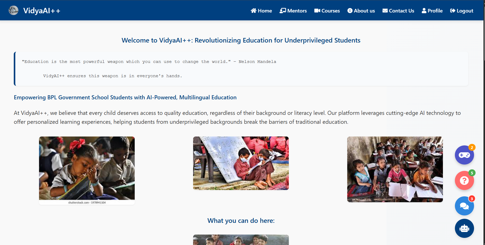

# 🎓 VidyaAI++ – AI-Powered Student Learning Assistant

VidyaAI++ is an AI-powered educational platform designed to provide personalized, multilingual, and interactive learning experiences for students. The application leverages Generative AI, YouTube recommendations, quizzes, and AI tutoring to make quality education more accessible, especially for students in government schools and underserved communities.

---

## 🌐 Live Demo

**Application:** https://vidya-ai-project.onrender.com

---

# 📖 Overview

VidyaAI++ combines Artificial Intelligence with modern web technologies to create a smart learning ecosystem. Students can learn in their preferred language, practice AI-generated quizzes, receive personalized recommendations, and interact with an AI-powered teacher assistant.

The platform aligns with the vision of India's National Education Policy (NEP) by making education inclusive, engaging, and accessible.

---

# ✨ Features

### 🔐 Secure Authentication
- User Registration & Login
- OTP-based password recovery
- Secure user authentication

### 🤖 AI Teacher Assistant
- Powered by Google Gemini
- Answers academic questions
- Supports multilingual conversations
- Explains concepts in simple language

### 📺 Smart YouTube Playlist Generator
- Subject-wise recommendations
- Class-specific educational videos
- Personalized learning resources

### 📝 AI Quiz Generator
- Dynamic quiz generation
- Topic-wise practice
- Instant scoring and feedback

### 🎯 Personalized Learning
- Performance-based recommendations
- Adaptive learning experience
- Progress-oriented suggestions

### 🌍 Multilingual Support
- Learn in multiple Indian languages
- Translation support for better accessibility

### 🎮 Educational AI Games
- Interactive learning games
- Improve engagement and retention

---

# 🛠 Tech Stack

## Frontend

- HTML5
- CSS3
- Bootstrap
- JavaScript

## Backend

- Python
- Flask

## Database

- SQLite

## AI & APIs

- Google Gemini API
- Google Translator API
- YouTube Data API

## Deployment

- Render
- GitHub

---

# 📂 Project Structure

```text
Vidya-AI-project/
│
├── app.py
├── database.db
├── otp_config.py
├── requirements.txt
├── README.md
│
├── static/
│   └── style.css
│
├── templates/
│   ├── aboutus.html
│   ├── home.html
│   ├── login.html
│   ├── profile.html
│   ├── quiz.html
│   ├── relatedvideos.html
│   └── ...
│
└── demopage.png
```

---

# 🚀 Installation

## Clone Repository

```bash
git clone https://github.com/Ramraju04/Vidya-AI-project.git

cd Vidya-AI-project
```

---

## Install Dependencies

```bash
pip install -r requirements.txt
```

---

## Configure Environment Variables

Create a `.env` file.

```env
GOOGLE_API_KEY=YOUR_GEMINI_API_KEY
YOUTUBE_API_KEY=YOUR_YOUTUBE_API_KEY
EMAIL=YOUR_EMAIL
EMAIL_PASSWORD=YOUR_PASSWORD
```

---

## Run Application

```bash
python app.py
```

Open your browser and visit:

```
http://127.0.0.1:5000
```

---

# 📸 Application Preview



---

# 🎯 Use Cases

- AI-powered learning assistant
- Government school education support
- Personalized education platform
- Quiz practice
- Language learning
- Student mentorship
- AI tutoring

---

# 💡 Future Enhancements

- Teacher Dashboard
- Student Analytics
- Progress Tracking
- AI Voice Assistant
- Live AI Tutor
- Real-Time Classroom Support
- Mobile Application
- Cloud Database Integration
- Student Performance Prediction

---

# 📊 Technologies Used

| Category | Technologies |
|----------|--------------|
| Programming | Python |
| Backend | Flask |
| Frontend | HTML, CSS, Bootstrap, JavaScript |
| Database | SQLite |
| AI | Google Gemini |
| APIs | YouTube API, Google Translate API |
| Deployment | Render, GitHub |

---

# 👨‍💻 Author

**Ramraju Bodda**

🎓 B.Tech in Artificial Intelligence & Machine Learning

- GitHub: https://github.com/Ramraju04
- Portfolio: https://ramarajuportfolio.lovable.app/

---

# ⭐ Support

If you found this project useful, please consider giving it a ⭐ on GitHub.

Your support helps improve the project and encourages future development.

---

## 📜 License

This project is intended for educational and learning purposes.
